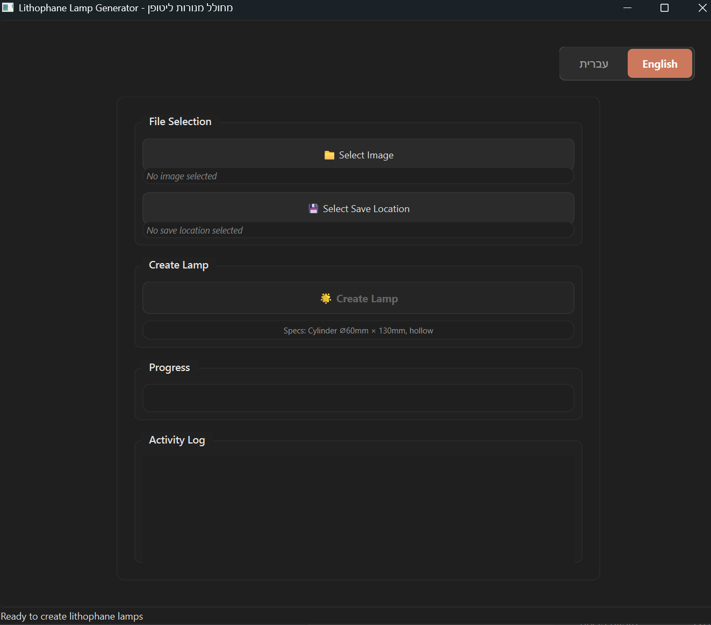

# Premium Lithophane Lamp Generator

[](https://www.python.org/downloads/)
[](https://github.com/shaibenisti/lithophane-lamp-generator)
[](LICENSE)
[](https://github.com/shaibenisti/lithophane-lamp-generator/stargazers)
[](https://github.com/shaibenisti/lithophane-lamp-generator/network/members)

A professional PyQt6 desktop application for creating 3D-printable lithophane lamp cylinders from images. Transform your photos into beautiful illuminated lamps with intelligent image processing, face detection, and high-precision 3D mesh generation.



## Gallery

<table>
  <tr>
    <td width="50%">
      
      <p align="center"><i>STL file loaded in slicer software</i></p>
    </td>
    <td width="50%">
      
      <p align="center"><i>Final printed lamp with LED illumination</i></p>
    </td>
  </tr>
</table>

## Features

### Intelligent Image Processing
- **Smart Face Detection** - Automatically detects and enhances portraits using OpenCV Haar Cascade
- **Shadow Lifting** - Analyzes and corrects underexposed areas for better visibility
- **Adaptive Gamma Correction** - Automatically selects optimal brightness curve based on image type
- **Skin Texture Smoothing** - Removes pores and fine wrinkles while preserving facial features
- **HEIC Support** - Direct loading of iPhone HEIC format images

### Professional 3D Generation
- **High-Precision Mesh** - Up to 1,400 angular segments using SciPy cubic interpolation
- **Hollow Cylinder Design** - Optimized for LED strip integration (Ø60mm × 130mm default)
- **Print-Ready STL Output** - Watertight mesh with automatic validation and repair
- **Configurable Dimensions** - Customize diameter, height, wall thickness, and coverage angle
- **Optimized Thickness Range** - 0.5mm (bright areas) to 2.5mm (dark areas)

### User Experience
- **Bilingual Interface** - Full Hebrew and English support with RTL/LTR layout switching
- **Real-Time Progress** - Background processing with live progress updates
- **Clean Dark Theme** - Modern, professional UI design
- **Activity Logging** - Detailed logs for troubleshooting and process transparency

## Installation

### Requirements
- **Python 3.8+**
- **Windows** (tested), Linux, or macOS (compatible)

### Quick Setup

1. **Clone the repository:**
```bash
git clone https://github.com/yourusername/lithophane-lamp-generator.git
cd lithophane-lamp-generator
```

2. **Install dependencies:**
```bash
pip install -r requirements.txt
```

3. **Run the application:**
```bash
python main.py
```

Or use the Windows batch file:
```bash
run.bat
```

### Dependencies
Core requirements:
- PyQt6 ≥6.4.0 - GUI framework
- opencv-python ≥4.7.0 - Image processing and computer vision
- numpy ≥1.21.0 - Numerical operations
- trimesh ≥3.20.0 - 3D mesh manipulation and STL export
- scipy ≥1.9.0 - Scientific computing (cubic interpolation)
- PyYAML ≥6.0.0 - Configuration management
- python-dotenv ≥1.0.0 - Environment configuration

Optional:
- pillow-heif ≥0.13.0 - iPhone HEIC format support

## Usage

### Basic Workflow

1. **Launch the application**
   - Run `python main.py` or double-click `run.bat` (Windows)

2. **Select your image**
   - Click "Select Image" button
   - Supported formats: JPG, PNG, BMP, HEIC
   - Recommended: High-quality images (1000px+ on longest side)

3. **Choose output location**
   - Click "Select Save Location"
   - Choose where to save the STL file

4. **Create the lamp**
   - Click "Create Lamp"
   - Wait for processing (1-3 minutes depending on image size)
   - Activity log shows detailed progress

5. **3D Print**
   - Open the STL file in your slicer software
   - Recommended settings:
     - Material: White PLA
     - Nozzle: 0.4mm
     - Layer height: 0.12mm
     - Infill: 100% (solid)
     - No supports needed

### Language Switching
Click the language toggle in the top-right corner to switch between English and Hebrew (עברית).

## Configuration

Settings are stored in `config/settings.yaml`. Edit this file to customize physical dimensions and quality settings.

### Key Settings

**Cylinder Dimensions:**
```yaml
cylinder:
  diameter: 60.0      # Outer diameter (mm)
  height: 130.0       # Cylinder height (mm)
  wall_thickness: 2.0 # Base wall thickness (mm)
```

**Printing:**
```yaml
printing:
  min_thickness: 0.5  # Thinnest areas (bright) in mm
  max_thickness: 2.5  # Thickest areas (dark) in mm
  nozzle_diameter: 0.4
  layer_height: 0.12
```

**Quality:**
```yaml
quality:
  resolution: 0.06              # Lower = higher detail (0.04-0.12)
  lithophane_coverage_angle: 195.0  # Degrees around cylinder (180-220)
  gamma_override: null          # null = smart auto-selection, or set 0.8-1.0
```

### Gamma Control

Gamma adjusts the brightness curve of the lithophane:
- **null** (default) - Smart automatic selection based on image type
- **0.80-0.85** - Brightens dark portraits significantly
- **0.90-0.95** - Slight brightening for normal images
- **1.0** - Linear, faithful to original

The smart gamma system automatically chooses optimal values based on:
- Face detection (portraits get gentler gamma)
- Image brightness (dark images get lower gamma)
- Shadow analysis

## Environment Configuration (Optional)

Create a `.env` file in the project root for advanced settings:

```bash
OPENCV_THREADS=4          # Number of OpenCV processing threads
LOG_LEVEL=INFO            # Logging level (DEBUG, INFO, WARNING, ERROR)
DEFAULT_LANGUAGE=en       # UI language (he=Hebrew, en=English)
MAX_MEMORY_GB=8           # Maximum memory usage
DEBUG_MODE=false          # Enable debug mode
```

## Output

The application generates:
- **STL file** - Ready for 3D printing
- **Log file** (`lamp_generator.log`) - Detailed processing information
- **Console output** - Real-time progress and statistics

### Typical Processing Time
- Small images (<1000px): 30-60 seconds
- Medium images (1000-2000px): 1-2 minutes
- Large images (>2000px): 2-4 minutes

## Technical Specifications

### Default Physical Dimensions
- **Outer diameter:** 60mm
- **Height:** 130mm
- **Inner diameter:** 56mm (4mm wall)
- **Lithophane coverage:** 195° (leaving gap for seam)
- **Thickness variation:** 0.5mm - 2.5mm

### Mesh Quality
- **Angular segments:** 800-1,400 (adaptive based on resolution)
- **Height segments:** 600-1,200 (adaptive)
- **Interpolation:** SciPy cubic for smooth surfaces
- **Topology:** Watertight, manifold, print-ready

## Troubleshooting

**Application won't start:**
- Verify Python 3.8+ is installed: `python --version`
- Reinstall dependencies: `pip install --upgrade -r requirements.txt`

**Face detection not working:**
- OpenCV Haar Cascade may not be installed
- Check logs for cascade loading errors
- Processing will continue without face enhancement

**STL file won't open:**
- Ensure you selected a valid output location
- Check disk space
- Review `lamp_generator.log` for errors

**Processing is very slow:**
- Reduce `resolution` value in `config/settings.yaml` (try 0.08 or 0.10)
- Close other applications to free memory
- Use smaller input images

**Lithophane too dark/bright when printed:**
- Adjust `gamma_override` in settings (try 0.85-0.90 for brighter)
- Verify using white PLA filament
- Check LED brightness

## Development

For technical documentation, architecture details, and development information, see:
**[Technical Documentation](docs/TECHNICAL.md)**

## Project Structure

```
lithophane-lamp-generator/
├── main.py                    # Application entry point
├── run.bat                    # Windows launcher
├── requirements.txt           # Python dependencies
├── config/
│   └── settings.yaml          # Configuration file
├── src/
│   ├── core/                  # Core configuration and constants
│   ├── gui/                   # PyQt6 user interface
│   ├── processing/            # Image and 3D processing
│   └── utils/                 # Utility modules
├── MEDIA/                     # Screenshots and examples
└── docs/                      # Documentation
    └── TECHNICAL.md           # Developer documentation
```

## License

This project is provided as-is for personal and commercial use. Feel free to modify and distribute.

## Credits

Built with:
- PyQt6 for the user interface
- OpenCV for image processing and face detection
- NumPy and SciPy for numerical computing
- Trimesh for 3D mesh generation and STL export

---

**Ready to create beautiful lithophane lamps!** 🏮
